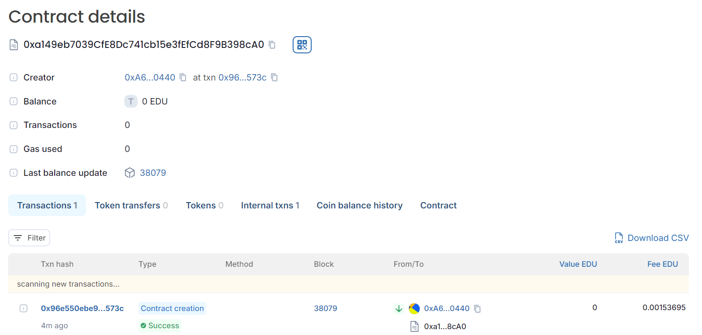

### README.md

# CollegeCourseReviews

## Vision
The **CollegeCourseReviews** contract aims to provide a decentralized platform where students can review colleges and courses. By leveraging blockchain technology, this project ensures transparency, immutability, and incentivizes student feedback. The goal is to offer valuable insights into the quality of education and learning environments at various institutions.

## Project Features
- **College and Course Review Submission**: Allows students to submit reviews for colleges and courses, including detailed ratings on various aspects.
- **Ratings and Feedback**: Students can rate colleges and courses on multiple parameters such as instructor quality, TA support, difficulty level, learning environment, course materials, and class participation.
- **Token Rewards**: Students are rewarded with tokens upon successful review submission. Tokens can be managed and transferred within the contract.
- **Aggregate Ratings**: The contract maintains aggregate ratings for each college, providing an overall view of reviews submitted by all students.
- **Personal Review Access**: Students can access their personal reviews and see the detailed feedback they have provided.

## Future Scope
- **Integration with ERC20 Tokens**: Implement ERC20 token standards for a more robust token management and transfer system.
- **Enhanced Review Parameters**: Include additional parameters for reviews based on user feedback and evolving needs.
- **User Authentication**: Implement user authentication to ensure that only eligible students can submit reviews and receive rewards.
- **Front-End Integration**: Develop a user-friendly front-end interface to interact with the smart contract, making it easier for students to submit reviews and manage tokens.
- **Scalability and Performance Optimization**: Optimize the contract for gas efficiency and scalability to handle a larger volume of reviews and interactions.

## Project Structure
- **`CollegeCourseReviews.sol`**: The main smart contract file containing the contract logic for adding colleges, submitting reviews, managing tokens, and querying reviews.
  - **Structs**: `Review` and `College` for defining the data models.
  - **Mappings**: Used for storing reviews, ratings, and token balances.
  - **Functions**: Includes functions for setting ratings, submitting reviews, providing tokens, and retrieving overall reviews.
  - **Events**: `ReviewSubmitted` and `TokensProvided` for logging important actions.

## Developer Details
- **Name**: Manya Gupta
- **Role**: Smart Contract Developer
- **Contact**: gmanya255@gmail.com
- **GitHub**: manyajhupta

## Deployement
Chain Name: Educhain Open Campus
Contract id: 0xa149eb7039cfe8dc741cb15e3fefcd8f9b398ca0

